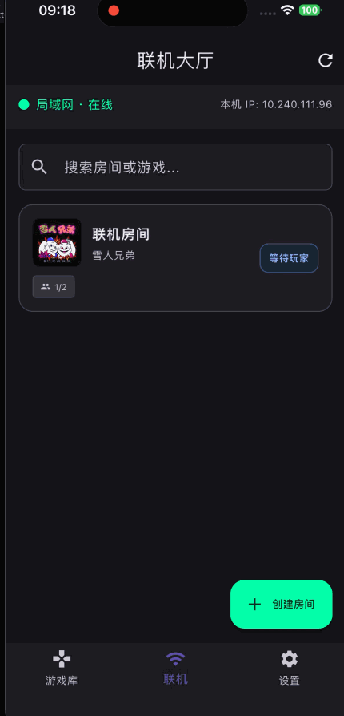

# Game Emulator

基于 Flutter 与 libretro 核心的多系统模拟器，当前支持 **GBA**（[gpSP](https://github.com/libretro/gpsp)）、**FC / NES**（[FCEUmm](https://github.com/libretro/libretro-fceumm)）与 **街机**（[FBNeo](https://github.com/finalburnneo/FBNeo) Libretro），具备本地游戏库、自动存档、变速游玩与局域网联机。

---

## 平台支持

| 平台 | 状态 | 说明 |
|------|------|------|
| **Android** | 支持
| **iOS** | 支持

---

## 截图



---

## 当前进度

### 已完成

| 模块 | 说明 |
|------|------|
| **模拟器核心** | `.gba` → gpSP；`.nes`/`.fds` 等 → FCEUmm；`.zip`/`.7z` → FBNeo |
| **虚拟手柄** | 触控按键映射，支持触觉反馈与 libretro 震动回调 |
| **自动存档** | 退出自动保存、进入自动读取；Android 公共目录 / iOS Documents |
| **游戏库** | ROM 导入、缩略图生成、搜索分类|
| **变速齿轮** | 1x ~ 3x 快进，音画同步加速 |

### 进行中 / 部分完成

| 模块 | 说明 |
|------|------|
| **局域网联机** | FC/NES 与街机采用房主仲裁锁步；GBA 使用 gpSP Wi-Fi/RFU packet 通道 |
| **性能优化** | 持续调优渲染与音频缓冲，降低发热 |

### 尚未实现

- 蓝牙 / MFi 外接手柄
- 金手指（Cheats）
- 手动多档位存档槽
- 画面滤镜（扫描线、CRT、像素平滑等 Shader 扩展）
---

## 未来计划

1. **联机对战** — 继续调优 GBA Wi-Fi/RFU 兼容性
2. **外设支持** — 蓝牙手柄、键盘映射
3. **增强体验** — 金手指、作弊码、ROM 信息展示
4. **画面增强** — Shader 滤镜链（HQ2X / Scanlines / Color correction）
5. **跨平台发布** — 跨平台自动构建 CI
6. **云存档**（可选）— 自定义配置云存档存放位置
7. **更多平台** — 街机与其他 libretro 核心扩展

---

## 项目结构

```
lib/
├── core/
│   ├── audio/           # PCM 音频输出
│   ├── haptics/         # 触觉反馈
│   ├── libretro/        # FFI 核心、渲染、存档
│   ├── network/         # 局域网联机
│   ├── settings/        # 应用设置
│   └── storage/         # 存档路径
├── features/
│   └── game_library/    # 游戏库
├── presentation/
│   ├── screens/         # 各页面
│   ├── widgets/         # 虚拟手柄、游戏卡片
│   └── theme/           # 主题
scripts/
├── build_gpsp_libretro.sh    # 编译 gpSP 核心
├── build_fceumm_libretro.sh  # 编译 FCEUmm 核心
├── build_fbneo_libretro.sh   # 编译 FBNeo 街机核心
└── build_all_cores.sh        # 一键编译全部核心
```

### 编译 libretro 核心

```bash
chmod +x scripts/*.sh

# 全部核心（推荐）
./scripts/build_all_cores.sh android

# 或单独编译
./scripts/build_gpsp_libretro.sh android
./scripts/build_fceumm_libretro.sh android
```

产物输出至各平台原生目录（**不会**进入 Flutter assets）：

| 平台 | 输出路径 |
|------|----------|
| Android | `android/app/src/main/jniLibs/arm64-v8a/`（仅 arm64） |
| iOS | `ios/Runner/Frameworks/` |
| macOS（本地调试） | `build/libretro/macos/` |

| 核心 | Android 库名 | iOS 库名 |
|------|----------------|----------|
| gpSP | `libgpsp_libretro.so` | `gpsp_libretro_ios.dylib` |
| FCEUmm | `libfceumm_libretro.so` | `fceumm_libretro_ios.dylib` |
| FBNeo | `libfbneo_libretro.so` | `fbneo_libretro_ios.dylib` |

街机 ROM 请使用 `.zip` / `.7z` 整包导入。BIOS 可放在 `assets/bios/`（随应用打包，首次运行会复制到 `GBAEmulator/system/`），也可手动放入该 `system/` 目录。

iOS 需在 Xcode 中将 `Frameworks` 下的 dylib 设为 **Embed & Sign**。

### 局域网联机（Lockstep）

FC/NES 与街机双人联机采用 **房主仲裁严格帧同步**：

- 房主按帧号组包 `FRAME_BUNDLE`，双方在同一帧上调用 `retro_run`
- 客人通过 `FRAME_INPUT` 上报按键（无帧号）；房主将输入写入 **当前模拟帧 + 1** 的调度表
- 固定 **1 帧输入延迟**（约 16 ms @ 60 fps），给网络留出缓冲
- 会话开始走 `LOCKSTEP_READY` / `LOCKSTEP_START` 握手

GBA 使用 gpSP 的 libretro `SET_NETPACKET_INTERFACE`，走独立 Wi-Fi/RFU packet 转发，不参与 FC/NES / 街机的锁步同步。

---

## 技术栈

- **模拟核心：** 
[gpSP](https://github.com/libretro/gpsp)（GBA）
[FCEUmm](https://github.com/libretro/libretro-fceumm)（NES/FC）  
[FBNeo](https://github.com/finalburnneo/FBNeo)（Arcade）
---

## 快速开始

```bash
flutter pub get
chmod +x scripts/*.sh
./scripts/build_all_cores.sh android   # 首次需编译核心
flutter run
```

环境要求：Flutter SDK ≥ 3.12、Android SDK + NDK（编译核心时）。

---

## 鸣谢

本项目站在巨人的肩膀上，特别感谢：

- **[gpSP](https://github.com/libretro/gpsp)** — GBA 模拟核心
- **[FCEUmm](https://github.com/libretro/libretro-fceumm)** — FC / NES 模拟核心（GPL-2.0）
- **[FBNeo](https://github.com/finalburnneo/FBNeo)** — 街机模拟核心（GPL-2.0+）
- **[libretro](https://www.libretro.com/)** — 统一的模拟器 API 规范
- 以及其他开源依赖的作者与社区贡献者

---

## License

本项目应用层代码采用 **MIT** 许可证。

gpSP、FCEUmm、FBNeo 等 libretro 核心的分发需遵守各自开源许可证。
